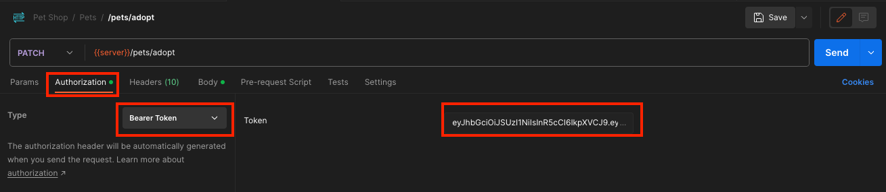

# Adding Token Auth

Now that we've covered a token crash course, it's time to harden our server and lock endpoints down.  We're only going to touch a couple of points here and leave the rest to experimentation as homework.

## Secure the `/adopt` Endpoint

Back in your `PetController` class, take a look at your `/adopt` endpoint.  You'll see we have two attributes above it:

```csharp
[HttpPatch, Route("adopt")]
```

We're going to add a third one:

```csharp
[HttpPatch, Route("adopt"), RequireAuth]
```

Your endpoint now requires a token to be sent with the request!  If you'd like, you can restart your server and try your Postman request again - it'll keep failing until you add a token as authorization:

```json
HTTP 401
{
    "message": "unauthorized",
    "errorCode": "PLATF-0111: TokenValidationFailed",
    "platformData": {
        "exception": {
            "details": {
                "endpoint": null,
                "code": "TokenValidationFailed",
                "detail": null
            },
            "message": "Token is empty or null.",
            "type": "PlatformException",
            "stackTrace": null
        }
    }
}
```

Adding a token to the request will now indicate that the _request is coming from the account the token represents_.  In the case of the token referenced in our last step, adding our previously-generated token as auth means the request will come from `SideshowBob`.  To do this, look for the `Authorization` tab in Postman, select `Bearer Token`, and paste the token into the text box:



Note that you should use a token _you_ generated; the one in this documentation is almost certainly expired.  Fire off the request again and you should see the unauthorized message vanish.

## Using Data Within Tokens

Now that our `/adopt` endpoint is locked down and represents an actual user of our system, we can actually remove `customerId`!  When a token is used for requests, you can grab information from it within Controller methods by using the `Token` property.  Let's modify our endpoint again:

```csharp
[HttpPatch, Route("adopt"), RequireAuth]
public ObjectResult Adopt()
{
    string petId = Require<string>("petId");
    
    Log.Local(Owner.Default, $"Account ID: {Token.AccountId}");
    Log.Local(Owner.Default, $"Screenname: {Token.ScreenName}");
    Log.Local(Owner.Default, $"Email     : {Token.Email}");
    Log.Local(Owner.Default, $"Valid For : {Token.SecondsRemaining} more seconds");
    Log.Local(Owner.Default, $"Requester : {Token.Requester}");

    Customer owner = _customers.FromId(Token.AccountId)
        ?? throw new PlatformException("Customer record not found.", code: ErrorCode.MongoUnexpectedFoundCount);
    Pet outgoing = _pets.Adopt(petId, owner.Id);
    
    return Ok(outgoing);
}
```

When `RequireAuth` is present, `Token` is guaranteed to be non-null, and will give you identifying information about the account making the request.  Since our token represents a `Customer.Id`, we no longer need the field previously required, and we can use the token to achieve the same effect / keep our Postman request simpler.  As a rule of thumb, keep the required information to an absolute minimum - when you _can_ use the Token information instead of making a consuming application pass in data, do it.  It's more secure and there's less room for error on the frontend implementation.

<hr />

**Quick Note on Logging**

We haven't really touched much on logging capabilities, but this gives you a quick sample of how we can pipe some limited information out.  More details are available in other documentation, but what's important to mention here is that `Log.Local()` means we don't send data to Loggly.  Other methods include `Verbose()`, `Info()`, `Warn()`, `Error()`, and `Critical()` - and these can all send logs.

The strings we're using here are just for debug and would make really poor logs since they include strings that may be variable.  Log messages should always be static and unchanging.  When dealing with Loggly, include variable data in the optional `data` parameter.

<hr />

## Secure the `/pets/add` Endpoint

We're going to do something a little different here.  Since adding pets to our stock is really something that only an employee should be able to do and not a customer, we're going to lock it down with an admin token instead:

```csharp
[HttpPost, Route("add"), RequireAuth(AuthType.ADMIN_TOKEN)]
public ObjectResult Add()
{
   ...
}
```

Admin tokens, while identical in format to regular tokens, have an extra flag on them that grants them elevated status.  The `ApiService` does not have a helper method to generate admin tokens, as the generation of admin tokens is restricted.  An admin token typically has unfettered access for projects it has an audience for, and take 10 years to expire.  Consequently, they shouldn't be shared anywhere or committed to any codebase - including this tutorial.

<hr />

**Homework: Get Your Admin Token from Dynamic Config (DC)**

Every project created with platform-common automatically creates an entry in Dynamic Config for itself once it successfully starts up.  Assuming you've done everything correctly, you'll have a DC section available to you in dev Portal.  Log in to Portal, open up DC and your pet shop section, and grab the admin token there for your Postman requests.  Note that you may need someone in #platform to grant you permissions to view DC before you can see the values.

Once you have it, add a pet with admin authorization.

<hr />

## More Information on `RequireAuth` Attributes

It's quick and easy to add authorization, but it can also be a challenge to maintain dozens of endpoints in a project when an attribute is forgotten, left out, or conflicts with another sibling attribute.  There are some general rules to help keep your code clean:

1. `RequireAuth` attributes are preferred at **class-level** as opposed to **method-level**.  While this tutorial has only shown the latter, it's a much safer practice to lock down an entire controller under the same auth rules.
2. Create an `AdminController` class with a root of `/shop/admin` and the admin auth attribute on it.  Keep **all** of your admin endpoints here and outside of other classes.  If for some reason you want to split it into multiple controllers instead, make sure "admin" appears in the controller names.
3. You won't want auth requirements on every endpoint in your project, but these endpoints will tend to be much rarer.  Consequently, the recommended practice is to lock down the relevant controller with `RequireAuth` and then _bypass_ the auth with a different attribute, `NoAuth` on that specific endpoint.  `NoAuth` takes the highest priority of anything; using this even in an admin controller will ignore all authentication requirements.  For example, being able to list all the pets in our care would be a good candidate for functionality that should be publicly available without logging in, and would benefit from a `NoAuth`.

The rules are second nature after some practice.  Once it's set up, all Admin features go into an `AdminController` and is secured with admin tokens, everything else is secured by regular tokens, and only when you're adding a public, no-auth endpoint do you need to bother with these attributes.

<hr />

**Homework: Add an `AdminController` and a New Endpoint to Blacklist Customers**

Imagine we have a customer we know doesn't treat animals well - we'll want to mark them as bad news.  We previously defined a `Blacklisted` property in our model, but we never really used it.  This is a great opportunity to add an admin endpoint to leverage this:

1. Add admin `RequireAuth` attribute at the class level.
2. Add a new endpoint to blacklist a customer and update the database
3. Add a check in the `/adopt` endpoint to enforce the blacklist; if the blacklist flag is set, throw an exception before the pet can be adopted.

<hr />

## Conclusion

Throughout this tutorial, we've covered:

* Important Terms & Definitions
* Project Setup
* Project Structure with Models, Controllers, and Services
* MINQ Introduction
* Model Validation
* Postman Introduction
* Refining Logic & Controlling Flows
* Token Auth Introduction
* Token Generation & Usage
* Basic Platform Code Styling

It may not seem like it, but you've gone through everything you need to to get started writing a microservice now.  While we barely scratched the service of what MINQ can do, performance implications, and didn't cover Dynamic Config (todo: update DC readme), you have a running server and the foundation to keep building.  If you need further help, feel free to reach out in #platform for tips, tricks, or other general advice.

Remember to keep your code as light and as readable as possible!

## Possible Future Tutorials:

1. Using MINQ Transactions
2. Using Dynamic Config
3. CI / Deployment
4. Using the QueueService
5. Data Cleanup
6. Improving Readability (custom exceptions, etc.)
7. Database Performance Issues
8. Slack Interop
9. Indexing