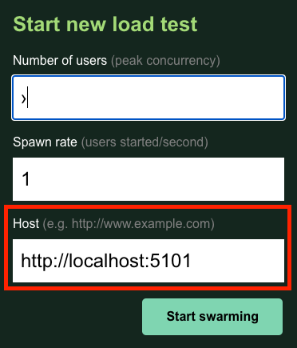

# Load Testing with Locust

Load testing is a key component of API development, and Locust is an easy-to-learn tool that employs Python scripts to "swarm" services.  It consumes less local resources than most competing tools and has a clean UI via browser interface.  This guide will walk you through the setup and sample loadtesting scenarios for Platform projects.

## Installation

#### 1. Install `pip`:

```
curl https://bootstrap.pypa.io/get-pip.py -o get-pip.py
...
python3 get-pip.py
```

#### 2. If you encounter the following warning:

```
WARNING: The scripts pip, pip3 and pip3.8 are installed in '/Users/Will/Library/Python/3.8/bin' which is not on PATH.
Consider adding this directory to PATH or, if you prefer to suppress this warning, use --no-warn-script-location.
NOTE: The current PATH contains path(s) starting with `~`, which may not be expanded by all applications.
```

* `sudo nano /etc/paths`
* Add the directory from the previous command.
* Save the file and exit.
* Restart Terminal.

#### 3. In Terminal, navigate to `{project}/Tests`.

#### 4. Copy the following content into `locustfile.py`:

```
from locust import HttpUser, task
import uuid

class ServiceUser(HttpUser):
# 	wait_space = between(1, 5)

	@task(1)
	def hello_world(self):
		self.client.get("{base}/health", name="/health")
```

_Note: Replace `{base}` with your service path._ 

#### 4. Run `locustfile.py`.

#### 5. In your browser, navigate to `localhost:8089`.

Enter `http://localhost:{port}`, where `{port}` is your service's assigned port number.

