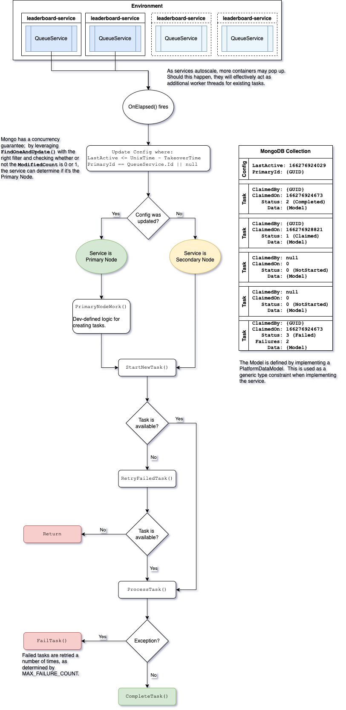

# Multi-Container Concurrent Processing via QueueService

## Introduction

When services are deployed, there are almost always multiple instances of that service in our clusters.  For the vast majority of platform operations, this isn't a problem; 90% of our work is just CRUD operations on Mongo.  However, there are certain situations when you want to guarantee that only _one_ of those instances can perform a certain job; one instance with authority over the others.  The `QueueService` can grant that power to you.

## Requirements

Mongo services.  Your service will need a valid connection string and Mongo enabled in `PlatformOptions`.

## History & Explanation

Previously, there was a `MasterService` in platform-common that attempted to track which node was the primary and which nodes were secondaries.  This service only allowed the primary node to process data, and if there was no active primary node, a secondary could promote itself after 30 seconds.  There was a problem, however.  The service itself was the authoritative source of its primary node status, and didn't have direct access to Mongo.  Instead, it relied on dependency injection and other services to achieve data persistence.  This introduced enough of a delay for multiple instances to collide as primary nodes.

In prod, we had multiple instances of `leaderboards-service` that believed they were the primary node.  This resulted in the primary GUID flipping back and forth every few seconds, but no logs indicating that one node was confiscating the primary status.  Frustratingly, the services behaved for _months_ in dev and staging environments, which made the issue nearly impossible to reproduce and diagnose.

`QueueService` is fundamentally different from this approach.  Mongo is now the authoritative source of which node is primary, and the service can directly access the data.  On every tick of its timer, the `QueueService` attempts to update the config with its ID, given the following conditions:

* The document type is a Config type (of which there can be only one)

And one of the following:

* The Primary Service ID is null; or
* The Primary Service ID is the same as the current service ID; or
* The LastActive timestamp is less than the UnixTimestamp, less the Takeover time.

Since Mongo offers us a promise that no two `FindOneAndUpdate()` calls can be honored concurrently, we can guarantee with these conditions that if the update modified any documents, that particular `QueueService` is the primary node.  This is also how we guarantee that claimed tasks only go to one worker service.

## Sample Use Case

Leaderboards are an incredibly important piece of the PvP engagement and player economy.  Leaderboard rollover happens on the platform side, but this is where a challenge presents itself: what happens if two instances of `leaderboards-service` are running, and it's time to roll over the daily leaderboards?  Can leaderboards roll over twice?  More?

It's not just possible, but has happened in the past.  Luckily, `QueueService` can come in and save the day!

## No longer "One Node to Rule them All"

`MasterService` was a useful tool for an early version, but it had a major scalability flaw; even if it didn't have any bugs, one node can easily end up with far too much work to reasonably achieve at scale.  If we had 50 million players, and each leaderboard could hold 50 players, that's still 1 million leaderboards to rollover.  There's simply no way one instance of `leaderboard-service` can handle that kind of workload - certainly not before another instance of it sees a period of inactivity long enough to try rollover itself.  Which brings us back to the original problem.

`QueueService`, on the other hand, has a major change; the primary node is responsible for enqueueing tasks that _any_ node, including the primary, can process.  This means that we can break down all of these tasks to very granular levels and leave the processing to our auto-scaling containers.  Want to cut the rollover time in half?  Double the number of `leaderboards-service` instances!

## Visual Aids

The below flowchart is really helpful for understanding the full scope of the service.



## Tutorial

1. Create a new class that inherits from `PlatformDataModel`.  This will be the data that gets passed between nodes; it should contain any and all information necessary to process a task.

```
public class MyData : PlatformDataModel
{
    // BsonElement attributes aren't strictly required, but without them, you may
    // find yourself fighting the Mongo driver on annoying serialization exceptions.
    [BsonElement("message")]
    public string Message { get; set; }
}
```

2. Create a new class that inherits from `QueueService<MyData>`.

```
public class FutileService : QueueService<MyData>
{
    //             collection : Required.  This is prepended with "queue_" in MongoDB.
    //   primaryNodeTaskCount : The number of tasks the primary node can attempt in one pass; should be low but nonzero.
    //                          Otherwise, the primary node may get swamped and lose control mid-process.
    // secondaryNodeTaskCount : The number of tasks a secondary node can attempt in one pass; 0 for int.MaxValue.
    public FutileService() : base(collection: "test", primaryNodeTaskCount: 10, secondaryNodeTaskCount: 0) { }
    
    // This fires after all of the tracked tasks are completed.
    protected override void OnTasksCompleted(MyData[] data) { }
    
    // This can only be executed by the primary node.  Create tasks here.
    protected override void PrimaryNodeWork() { }
    
    // Define all the processing logic here.  Both primary and secondary nodes use this.
    protected override void ProcessTask(MyData data) { }
}
```

3. Let's add enough tasks that our primary node can't possibly keep up with itself.  We've only allowed our primary node to process a maximum of 10 tasks before it has to wait for its next `OnElapsed()` event.  So, if we add more than 10 tasks per pass, it will never be able to complete them all.

```
    ...
    private static int _count;
    
    protected override void PrimaryNodeWork() 
    {
        int rando = new Random().Next(5, 30);
        while (--rando > 0)
            CreateTask(new MyData
            {
                Message = $"Task {++_count}"
            });
    }
    ...
```

4. On average, we'll be generating 17 new tasks.  We'll soon be building up an excess!  But for now, let's define what the processing logic will be.  Let's keep it simple:

```
    ...
    protected override void ProcessTask(MyData data)
    {
        Log.Local(Owner.Will, $"{(IsPrimary ? "(Primary)" : "(Secondary)")} Processed '{data.Message}'");
    }
    ...
```

5. We're almost ready to go, but there's one little bit of housekeeping to take care of.  Since the `MyData` class is used exclusively within this implementation of the `QueueService`, let's bring it in as a private class:

```
public class FutileService : QueueService<FutileService.MyData>
{
    ...
    private class MyData : PlatformDataModel
    {
        [BsonElement("message")]
        public string Message { get; set; }
    }
}
```

6. We're good to go!  Build and run the service from within Rider.  Before too long, you'll see tasks being created:

```
...
Will    |     125,579ms | LOCAL     |        RolloverService_old.PrimaryNodeWork | (Primary) Adding 19 tasks
Will    |     125,964ms | LOCAL     |                   QueueService`1.OnElapsed | (Primary) Processing up to 10 tasks
Will    |     126,044ms | LOCAL     |               RolloverService_old.MoveNext | (Primary) Processed 'Task 7'
Will    |     126,145ms | LOCAL     |               RolloverService_old.MoveNext | (Primary) Processed 'Task 14'
Will    |     126,248ms | LOCAL     |               RolloverService_old.MoveNext | (Primary) Processed 'Task 16'
Will    |     126,344ms | LOCAL     |               RolloverService_old.MoveNext | (Primary) Processed 'Task 8'
Will    |     126,445ms | LOCAL     |               RolloverService_old.MoveNext | (Primary) Processed 'Task 17'
Will    |     126,549ms | LOCAL     |               RolloverService_old.MoveNext | (Primary) Processed 'Task 9'
Will    |     126,647ms | LOCAL     |               RolloverService_old.MoveNext | (Primary) Processed 'Task 15'
Will    |     126,748ms | LOCAL     |               RolloverService_old.MoveNext | (Primary) Processed 'Task 18'
Will    |     126,849ms | LOCAL     |               RolloverService_old.MoveNext | (Primary) Processed 'Task 19'
Will    |     126,949ms | LOCAL     |               RolloverService_old.MoveNext | (Primary) Processed 'Task 20'
```

7. After a few minutes, the primary node will be overwhelmed; we're creating more tasks in its work method than it can handle.  Let's help it out with a secondary node.  With your primary node still running within Rider, open up Terminal (or your local command line).  Navigate to the output directory, where your service `.dll` lives.  Run the following command to start up a secondary node:

```
dotnet {service}.dll
```

8. After the secondary node has had a chance to hit its `OnElapsed` event, you'll see it blast through all the remaining tasks; we gave it a count of 0, after all, so it pauses its timer until there are no more tasks left for it to claim and process.  The two nodes are now running together, and whenever the primary node generates more work than it can handle, you'll see those tasks get picked up by the secondary.  If you inspect the Mongo database, you can also watch the tasks as they get claimed and updated.

```
Will    |     124,682ms | LOCAL     |               RolloverService_old.MoveNext | (Secondary) Processed 'Task 173'
Will    |     124,721ms | LOCAL     |               RolloverService_old.MoveNext | (Secondary) Processed 'Task 171'
Will    |     124,772ms | LOCAL     |               RolloverService_old.MoveNext | (Secondary) Processed 'Task 166'
Will    |     124,820ms | LOCAL     |               RolloverService_old.MoveNext | (Secondary) Processed 'Task 167'
Will    |     124,869ms | LOCAL     |               RolloverService_old.MoveNext | (Secondary) Processed 'Task 165'
Will    |     124,920ms | LOCAL     |               RolloverService_old.MoveNext | (Secondary) Processed 'Task 169'
Will    |     124,969ms | LOCAL     |               RolloverService_old.MoveNext | (Secondary) Processed 'Task 175'
Will    |     125,020ms | LOCAL     |               RolloverService_old.MoveNext | (Secondary) Processed 'Task 176'
Will    |     125,070ms | LOCAL     |               RolloverService_old.MoveNext | (Secondary) Processed 'Task 174'
Will    |     125,128ms | LOCAL     |               RolloverService_old.MoveNext | (Secondary) Processed 'Task 177'
Will    |     125,174ms | LOCAL     |               RolloverService_old.MoveNext | (Secondary) Processed 'Task 178'
Will    |     125,220ms | LOCAL     |               RolloverService_old.MoveNext | (Secondary) Processed 'Task 179'
// For bonus points, stop your Rider service and wait several minutes!  Eventually, the Terminal service will take over as the primary node.  The QueueService's MS_TAKEOVER constant determines the time it takes to promote a secondary node.
```

9. But wait, there's more!  As one final feature, it's sometimes necessary to store a value between sessions, or, for example, if a service crashes or otherwise needs to be redeployed.  The `QueueService` contains two useful methods to aid with this `Get(string)` and `Set<T>(string, object)`.  The single config document in the `QueueService`'s collection has a `GenericData` object in it, and this data can hold whatever settings are needed for proper operation of the service.  In the case of Leaderboards, for example, this is necessary to track when leaderboards were last rolled over.

## Tracked vs. Untracked Tasks

While it's nice to be able to delegate tasks out to other servers with a queue, sometimes there's a need to perform some sort of cleanup action when those tasks are completed.  Introduced in platform-common-1.2.2, we now have the capability of doing exactly this.  Enter the concept of tracking:

* When a tracked task is created, a hashset in the config is appended with the task's ID.
* As tasks are completed, their IDs are removed from the hashset.
* Once the hashset has been emptied and at least one cycle has passed, the primary node:
  * Marks all successful tasks as "acknowledged".
  * Fires off `OnTasksCompleted(T[] data)`, with `data` being the same task data from all of the acknowledged tasks.
* The next time a tracked task is added, this process repeats.

Tasks can be either **tracked** or **untracked**.

There are two methods of creating tasks for processing.  The first is to use `CreateTask()`; this is the default option and is used elsewhere in this readme.  The second is to use `CreateUntrackedTask()`; this is a situational workaround to ignore the default flow above.  Untracked quests will not trigger the `OnTasksCompleted()` callback.

## FAQs

### What Happens if the Primary Node Gets Overtaken While Working?

Well, ideally, nothing of consequence.  As long as you keep your processing light in `PrimaryNodeWork()`, even if a node loses its primary status, it should just be doing work on tasks, and will be demoted to a secondary node on its next `OnElapsed` cycle.  This may mean that there's actually no consequence to letting the primary node try to handle a _ton_ of tasks.  Maybe it doesn't matter if the primary node is changing hands constantly.  This is simply untested at the moment.  

However, if the service needs 20 minutes to complete the logic in `PrimaryNodeWork()`, you may find yourself with a problem on your hands of two primaries - so don't do this!  Leave all the heavy work to `ProcessTask(T)`!  

There's only so much PEBKAC that can be prevented!

### What Happens if `ProcessTask()` Fails?

Tasks that hit exceptions are automatically retried up to 5 times.  After that, they remain in Mongo with a failed status.  They won't be cleared out automatically so you can try to debug them.

### What Happens if a Task is Claimed But Never Completes?

This can happen when a server is shut down or otherwise dies mid-processing, so it never marks a Task as either failed or completed.  Instead, these claimed tasks will be stuck in limbo for a while.  This is known as a **stalled task**.

As of platform-common-1.3.104, stalled tasks are reset to their unclaimed state after a period of 30 minutes.  This is a period long enough that it's reasonable to assume any processing has failed and is no reasonable process would be happening on it.

When tasks are reset, a warning-level log is fired with a stalled task count.

If this time limit becomes a problem, we can add additional logic to it, such as enabling the processing node to check in (it could do this by updating the `QueuedTask.ClaimedOn` timestamp to the current time), or alternatively, making the time configurable in `PlatformOptions` or `DynamicConfig`.

### How Long do Tasks Persist in Mongo?

7 days.  The primary node deletes any task that's older than that on every cycle.

## Next Steps

1. If the primary node work limit can safely be removed / there's no downside of the primary node switching, we can remove the work limits altogether.
2. For further optimization, it might be beneficial to support claiming / processing more than one task at once (batch processing).  This would reduce the number of reads / writes on the database by a factor of the batch size.
3. Translate the QueueService to MINQ for readability / automatic indexing.
4. Tracked tasks are currently kept in an unbound array.  While the service was never intended to handle _very large numbers_ of tracked tasks, this can lead to performance problems if misused.  Updating this to a CountDocuments query is safer.